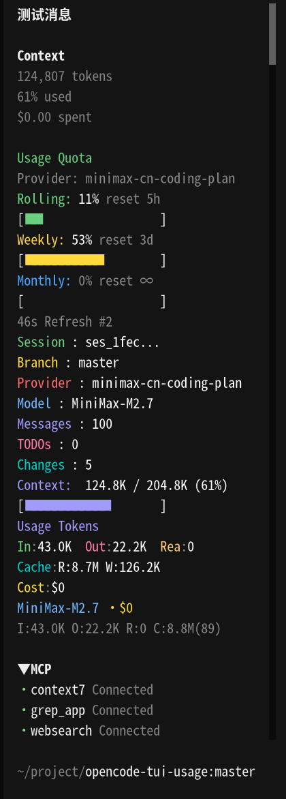

# OpenCode TUI Usage Plugin

OpenCode TUI 插件，在侧边栏显示用量和额度信息，支持多额度 provider。



## 功能特性

- 📊 实时显示 Rolling / Weekly / Monthly 三种维度的额度使用情况
- 🎨 彩色标签：Rolling(绿) / Weekly(黄) / Monthly(蓝)
- 📈 进度条可视化展示使用比例
- 🔄 自动根据当前会话的 provider 切换数据源
- 🛠️ 支持扩展新的 provider 适配器

## 安装

在 `~/.config/opencode/tui.json` 中添加插件路径：

```json
{
  "$schema": "https://opencode.ai/tui.json",
  "plugin": ["@yinxe/opencode-tui-usage@latest"]
}
```

重启 OpenCode 使插件生效。

> 首次配置或修改插件版本后，下次重启 OpenCode 会花费一些时间从 npm 自动下载安装插件。

## 配置额度 Provider

插件支持多个额度 provider，会根据当前会话的 `providerID` 自动选择对应的适配器。

### 环境变量引用

配置值支持两种环境变量引用格式，从 `process.env` 读取实际值：

| 格式 | 示例 | 说明 |
|------|------|------|
| `${VAR}` | `"apiKey": "${MY_KEY}"` | 旧写法（兼容） |
| `{env:VAR}` | `"apiKey": "{env:MY_KEY}"` | 新写法 |

### MiniMax-CN

适用于 `providerID` 为 `minimax-cn-coding-plan` 的会话。

创建 `~/.config/opencode/usage.provider.json`：

```json
{
  "providers": {
    "minimax-cn-coding-plan": {
      "apiKey": "${MINIMAX_API_KEY}"
    }
  }
}
```

设置环境变量：

```bash
export MINIMAX_API_KEY="your-api-key-here"
```

### OpenCode-Go

适用于 `providerID` 为 `opencode-go` 的会话。

在 `~/.config/opencode/usage.provider.json` 中添加：

```json
{
  "providers": {
    "opencode-go": {
      "cookie": "${OPENCODE_GO_AUTH_COOKIE}",
      "workspaceId": "${OPENCODE_GO_WORKSPACE_ID}"
    }
  }
}
```

设置环境变量：

```bash
export OPENCODE_GO_AUTH_COOKIE="your-cookie"
export OPENCODE_GO_WORKSPACE_ID="wrk_xxxxxxxxxxxx"
```

### 获取 OpenCode-Go 配置

1. 登录 https://opencode.ai
2. 打开浏览器开发者工具 → Network
3. 访问 `/workspace/{workspaceId}/usage` 页面
4. 找到 `_server` 请求，从 Request Headers 复制完整的 `cookie`
5. workspaceId 从 URL 中获取（格式：`wrk_` 开头）

## 开发

```bash
# 安装依赖
npm install

# 类型检查
npm run lint

# 构建输出到 dist/
npm run build

# 监听模式（开发时使用）
npm run dev
```

## 目录结构

```
src/
├── tui.tsx              # 插件入口，注册 sidebar_content slot
├── usage.tsx            # Usage 组件（彩色标签 + 进度条）
├── session-info.tsx     # Session Info 组件
├── components.tsx       # 可复用组件
└── quota/               # 额度服务
    ├── types.ts         # QuotaData, QuotaResult 类型定义
    ├── provider.ts      # QuotaProvider 接口
    ├── service.ts       # QuotaService 管理多 provider
    ├── config.ts        # 读取 usage.provider.json
    └── providers/      # provider 适配器
        ├── minimax.ts
        └── opencode-go.ts
```

## 添加新的 Provider 适配器

如果需要支持新的额度来源（如其他 AI provider），按以下流程添加：

### 1. 抓包获取 API

在浏览器中打开目标网站的额度页面（如 `https://example.com/workspace/xxx/usage`），打开开发者工具 → Network，找到获取额度数据的请求：

- **Chrome/Edge**: 右键请求 → Copy → Copy as cURL
- **Firefox**: 右键请求 → Copy Value → Copy as cURL

### 2. 调试 curl，精简参数

拿到 curl 后，在终端中反复调试，逐步移除不必要的 headers 和参数，直到找到最小可复现的请求。常用技巧：

```bash
# 逐步删除 headers，看哪些是必需的（通常是 Authorization/Cookie）
# 移除浏览器特有的 headers：sec-fetch-*, user-agent, referer, accept-language 等
# 保留核心：认证信息 + Content-Type

# 调试过程中可以用 | jq 格式化响应，方便分析
curl -s 'https://example.com/api/quota' \
  -H 'Authorization: Bearer xxx' \
  | jq .
```

目标：得到一个**稳定可复现**、**参数最少**的 curl 命令。

### 3. 分析响应结构

运行精简后的 curl，分析响应 JSON，找到需要的数据字段：

- 哪些字段对应 Rolling / Weekly / Monthly 的已用量和总量？
- 哪些字段包含重置倒计时？
- 是否有业务状态码需要检查？

将响应中的字段映射到 `QuotaData` 结构：

| 响应字段 | QuotaData 字段 | 说明 |
|----------|---------------|------|
| `xxx.total` / `xxx.used` | `rolling.usage` | 计算百分比：`used / total * 100` |
| `xxx.reset_time` | `rolling.reset` | 用 `formatDurationCompact()` 格式化 |
| ... | ... | ... |

### 4. 编写适配器

在 `src/quota/providers/` 下创建 `{provider-name}.ts`，参考已有适配器实现：

```typescript
import type { QuotaData, ProviderConfig } from "../types.js";
import { QuotaProvider, resolveEnvVar } from "../provider.js";
import { formatDurationCompact } from "../../formatters.js";

export class MyQuotaProvider implements QuotaProvider {
  readonly name = "my-provider";  // 与 usage.provider.json 中的 key 对应
  private apiKey: string | undefined;

  init(config: ProviderConfig, _credentials: Record<string, unknown>): void {
    // 读取 config 并解析环境变量
    this.apiKey = resolveEnvVar(config.apiKey as string | undefined);
  }

  async fetchQuota(): Promise<QuotaData | null> {
    if (!this.apiKey) {
      console.warn("[MyQuotaProvider] Missing apiKey");
      return null;
    }

    // 用 fetch 调用精简后的 API
    // 检查 HTTP 状态码和业务状态码
    // 将响应映射为 QuotaData 返回
  }
}
```

### 5. 注册到 QuotaService

在 `src/quota/service.ts` 中导入并注册：

```typescript
import { MyQuotaProvider } from "./providers/my-provider.js";

// 在 constructor 中添加：
this.registerProvider(new MyQuotaProvider());
```

### 6. 添加配置

在 `~/.config/opencode/usage.provider.json` 中添加 provider 配置：

```json
{
  "providers": {
    "my-provider": {
      "apiKey": "${MY_API_KEY}"
    }
  }
}
```

### 7. 测试

构建并重启 OpenCode，切换到对应 provider 的会话，检查侧边栏是否正常显示额度数据。

## 调试

查看插件日志：

```bash
cat ~/.local/share/opencode/log/$(ls -t ~/.local/share/opencode/log/ | head -1) | grep -i "tui.plugin\|QuotaService\|MiniMaxCN\|OpenCodeGo"
```

常见问题：

| 问题 | 原因 | 解决方案 |
|------|------|----------|
| 侧边栏无显示 | 缺少 `"oc-plugin": ["tui"]` | 检查 package.json |
| JSX 报错 | 缺少 pragma | 每个 .tsx 顶部加 `/** @jsxImportSource @opentui/solid */` |
| 显示 "No data" | provider 未注册或配置缺失 | 检查 usage.provider.json 和环境变量 |
| opencode-go 500 错误 | cookie 过期或 headers 不对 | 重新抓包获取最新 cookie |

## 技术栈

- **Solid.js** - 响应式 UI 框架
- **@opentui/solid** - TUI 组件库（`<box>`, `<text>` 等）
- **TypeScript** - 类型安全

## CI/CD 自动化发版

本项目使用 GitHub Actions 实现自动化发版。推送 `v*` 格式的 tag 后，**同时发布到 npm 和 GitHub Packages**。

### 发布流程

使用 `npm version` 管理版本号（会自动创建 tag）：

```bash
# 更新版本并创建 tag
npm version patch  # 0.0.1 → 0.0.2
npm version minor  # 0.0.1 → 0.1.0
npm version major  # 0.0.1 → 1.0.0

# 推送 tag 触发 CI/CD
git push origin v0.0.3
```

### 自动触发的工作流

推送 tag 后，以下 job 会自动执行：

```
build → publish-npm + publish-github
```

| Job | 目标 | 依赖 |
|-----|------|------|
| `build` | 安装依赖、构建项目、运行测试 | - |
| `publish-npm` | 发布到 [npm registry](https://www.npmjs.com/) | build |
| `publish-github` | 发布到 [GitHub Packages](https://github.com/Yinxe/opencode-tui-usage/packages) | build |

### 首次发版配置

1. **GitHub Packages 认证**
   - 无需额外配置，使用内置 `GITHUB_TOKEN`

2. **npm 认证**（如需发布到 npm）
   - 在 [npm.npmjs.com](https://www.npmjs.com/) 创建 Access Token
   - 在 GitHub 仓库 Settings → Secrets and variables → Actions 添加 secret：
     - Name: `npm_token`
     - Secret: 你的 npm access token

3. **scoped 包配置**
   - 包名 `@yinxe/opencode-tui-usage` 已在 package.json 中配置
   - `publishConfig.registry` 指定发布到哪个 registry

### 发布地址

| 平台 | 包名 | 地址 |
|------|------|------|
| npm | `@yinxe/opencode-tui-usage` | https://www.npmjs.com/package/@yinxe/opencode-tui-usage |
| GitHub Packages | `@yinxe/opencode-tui-usage` | https://github.com/Yinxe/opencode-tui-usage/packages |

## License

MIT